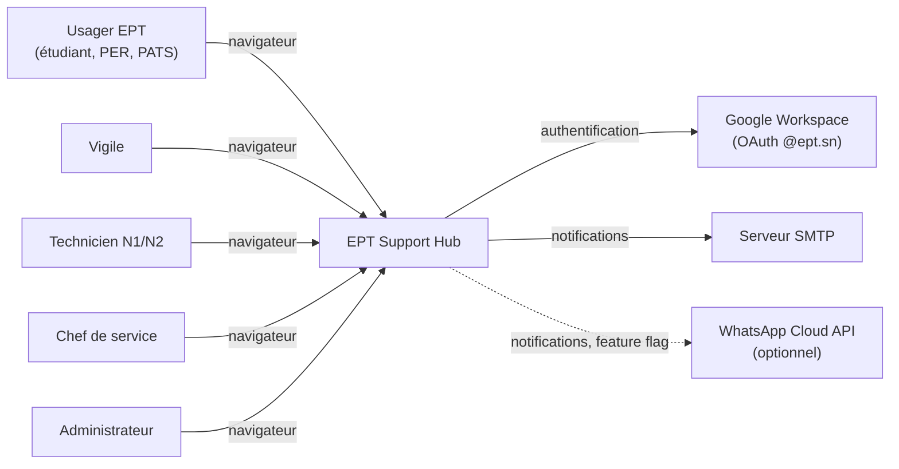
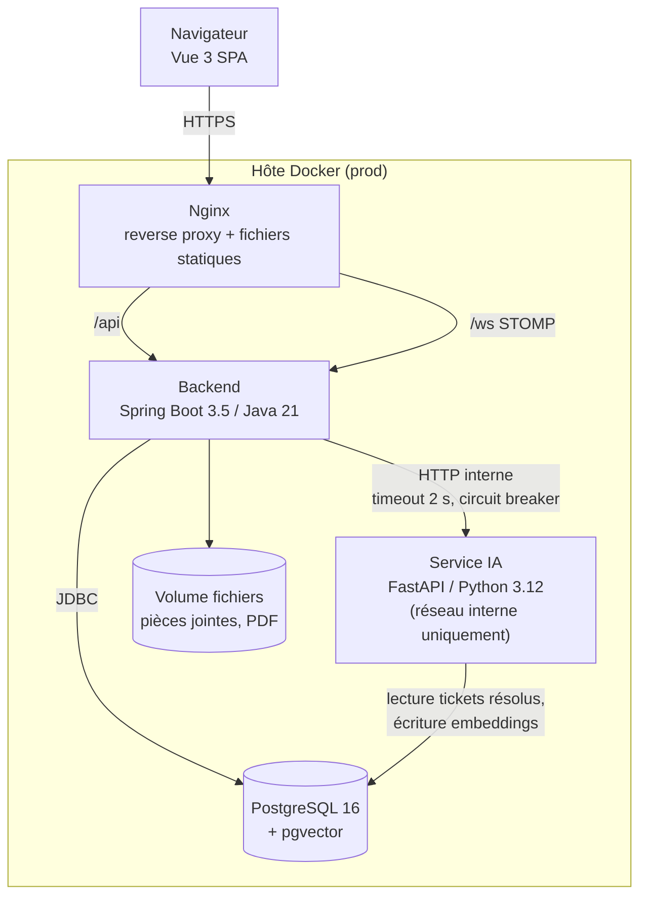
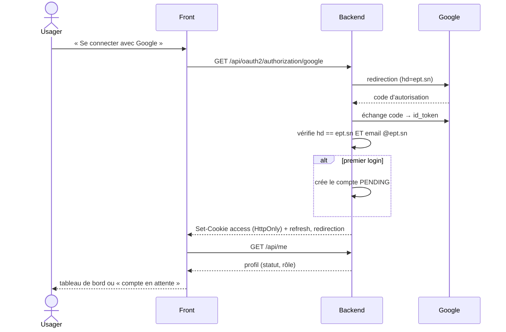
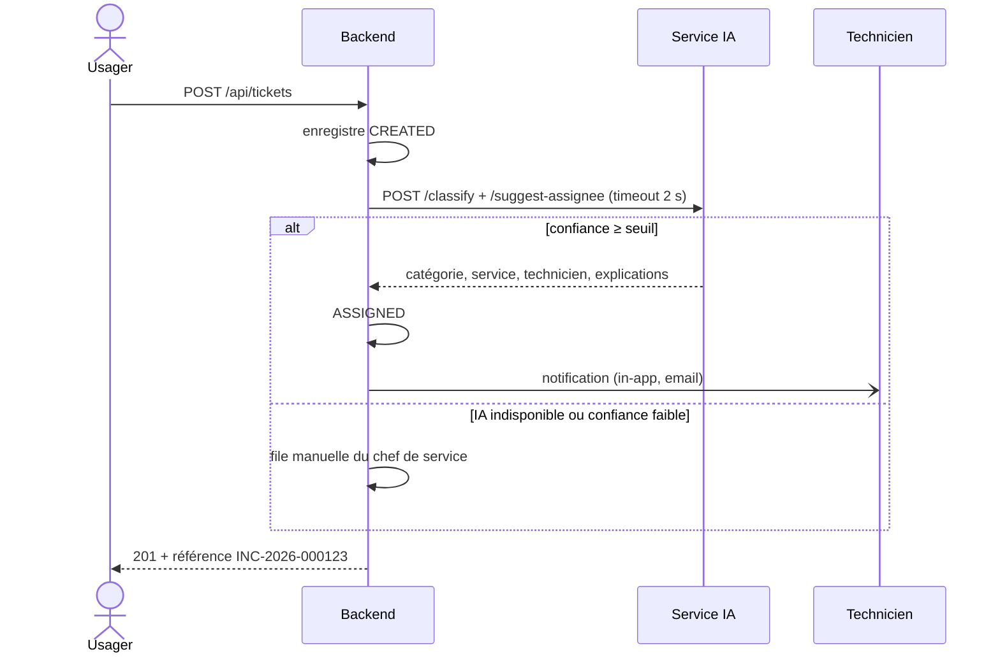

# Architecture

EPT Support Hub est une application web composée de trois services applicatifs et d'une base unique, livrée sous forme de monorepo ([ADR 0001](adr/0001-monorepo.md)).

## Contexte (C4 — niveau 1)



## Conteneurs (C4 — niveau 2)



Principes :

- **Le backend est le seul point d'entrée métier.** Le front ne parle jamais au service IA ; le service IA n'est pas exposé par Nginx.
- **Dégradation gracieuse** : si l'IA ne répond pas, le ticket est créé quand même et part dans la file manuelle du chef de service.
- **Une seule base** : relationnel, vecteurs et historique des causes racines ([ADR 0002](adr/0002-pgvector-over-mongodb.md)).
- **Auth** : OAuth Google géré par le backend, session portée par un JWT court dans un cookie HttpOnly ([ADR 0004](adr/0004-auth-httponly-cookie.md)).
- **Temps réel** : STOMP sur WebSocket ([ADR 0003](adr/0003-stomp-over-socketio.md)).

## Backend — découpage par fonctionnalité

```
sn.ept.supporthub
├── auth           OAuth2 Google, JWT cookie, refresh, login dev
├── user           comptes, rôles, statut PENDING/ACTIVE/SUSPENDED, compétences
├── organization   services (configurables), zones (arbre)
├── ticket         incidents, machine à états, commentaires, pièces jointes, historique
├── sla            politiques service × priorité, job de détection
├── request        besoins temporaires (entité séparée des incidents)
├── ai             client HTTP vers le service IA (Resilience4j)
├── notification   NotificationChannel : in-app (STOMP), email, WhatsApp
├── report         PDF (Thymeleaf + OpenHTMLtoPDF)
├── dashboard      requêtes d'agrégation KPI
├── audit          journal des actions sensibles
└── common         config, erreurs ProblemDetail, pagination, storage
```

Chaque package contient ses contrôleurs, services, entités, repositories et DTO. Un package n'accède aux entités d'un autre qu'à travers son service public.

## Flux principaux

### Connexion



### Création d'un ticket avec IA



## Environnements

| | Dev (`docker-compose.yml`) | Prod (`infra/docker-compose.prod.yml`) |
|---|---|---|
| Front | Vite dev server, HMR | fichiers statiques derrière Nginx |
| Backend | `spring-boot:run` + DevTools, profil `dev` | JAR en couches, profil `prod`, non-root |
| IA | `uvicorn --reload`, port exposé | 2 workers, réseau interne seulement |
| DB | port 5432 exposé | aucun port exposé |
| Mail | Mailpit | SMTP réel |
